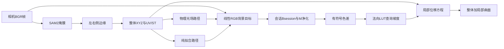

# 从整体曲面到局部形变：当前实现的重建数学

本文说明本仓库当前实际执行的完整重建链路：

1. 从相机图像和 SAM2 掩膜恢复整体规则曲面；
2. 按配置选择“物理光场 + 残差拟合”或“绝对背景纯拟合”；
3. 用会话 $B/M$ 基底净化线性 RGB 色差；
4. 用已知半径球建立“色差到局部坡度”的查找表；
5. 在弯曲参考曲面上求局部法向位移。

本文以代码为事实源，而不是算法设想。主要对应：

- 相机标定与整体 CPU 兼容重建：[calibrate_camera.py](../calibrate_camera.py)、
  [utils/process.py](../utils/process.py)；
- 整体 JAX 重建：[utils/jax_reconstruction.py](../utils/jax_reconstruction.py)；
- 光场与残差：[calibrate_lightfield.py](../calibrate_lightfield.py)、
  [utils/lightfield.py](../utils/lightfield.py)、
  [utils/gpu_residual_fit.py](../utils/gpu_residual_fit.py)；
- 法向标定：[calibrate_norm.py](../calibrate_norm.py)；
- 局部重建：[recon.py](../recon.py)、
  [utils/jax_local_reconstruction.py](../utils/jax_local_reconstruction.py)；
- 实时组合入口：[get_surface.py](../get_surface.py)、
  [render_lightfield.py](../render_lightfield.py)。

运行步骤另见[标定球法向标定与局部重建](local_reconstruction.md)；已停用 oracle
的历史消融数据另见[残差模态数量与在线 oracle 对比实验](residual_mode_and_oracle_comparison.md)。
后者不是当前生产路径的定义。

配置项以 [config.yaml](../config.yaml) 为准。文中列出的“当前值”只是当前仓库快照，
不是算法常数。

---

## 1. 端到端问题

输入是相机 BGR 帧。最终目标是在同一个规则网格上得到

$$
\mathbf X_{\mathrm{out},ij}
=\mathbf X_{ij}+d_{ij}\mathbf n_{ij},
$$

其中：

- $\mathbf X_{ij}$ 是从外轮廓恢复的整体参考曲面；
- $\mathbf n_{ij}$ 是参考曲面单位法向；
- $d_{ij}$ 是局部接触引起的法向位移。

数据流为：

整体几何、光场、局部观测和残差场使用五个统一配置的规则网格：

- `geometry_grid`：边缘配对和整体几何的基础网格；
- `lightfield_grid`：物理光场积分与光栅化网格；
- `observation_grid`：规范残差拟合样本、全分辨率色差采样和局部位移求解网格；
- `residual_coefficient_grid`：残差 $B/M$ 三次 B 样条控制系数网格；
- `residual_texture_grid`：运行时把 $B/M$ 展开成规范曲面纹理的网格。

当前依次为 $120\times52$、$120\times52$、$400\times202$、$32\times16$
和 $256\times128$。前三个网格的列数包含左右边界，所以 $52$ 列表示 $50$ 个
内部补点加 $2$ 个边界点；后两个网格位于规范曲面坐标域，不表示新的三维边界点。

---

## 2. 坐标、索引与颜色约定

### 2.1 图像与相机坐标

原图像素记为

$$
\mathbf u=(u,v)^\mathsf T.
$$

世界坐标中的曲面点记为

$$
\mathbf P=(X,Y,Z)^\mathsf T,
$$

世界到相机的变换是

$$
\mathbf q=\mathbf R\mathbf P+\mathbf t.
$$

本系统只估计四个外参自由度：

$$
\mathbf R=\operatorname{Rodrigues}(\boldsymbol\omega),\qquad
\mathbf t=(t_x,0,0)^\mathsf T.
$$

### 2.2 规则曲面参数

整体网格行列记为 $(i,j)$。规范坐标为

$$
s_i=\frac{i}{N-1},\qquad
t_j=\frac{j}{F+1},
$$

其中 $N$ 是截面数，$F$ 是每个截面的内部补点数。左右边界分别满足
$t=0$ 和 $t=1$。

代码中的 `uv` 是原图像素坐标，`st` 是规范曲面坐标。两者不能混用。

### 2.3 颜色空间与残差符号

OpenCV 输入是 uint8 BGR。所有光场、残差拟合、LUT 标定和局部输入都在线性 RGB
中计算。设相机线性 RGB 为 $\mathbf I_{\mathrm{cam}}$，则核心残差使用

$$
\text{相机}-\text{渲染},
$$

而不是反号。用于局部重建和法向 LUT 的色差保留完整符号：

$$
\Delta\mathbf C=\mathbf R_{\mathrm{clean}}.
$$

因此通道相对背景变暗和变亮都参与法向映射。有符号诊断图以中性灰表示零，
差分有效域之外仍显示为黑色。

---

## 3. 单目相机模型

### 3.1 棋盘格标定

`calibrate_camera.py` 使用平面棋盘格。若内角点为 $(a,b)$，方格边长为 $d$ mm，
棋盘世界点为

$$
\mathbf Q_{ab}=(ad,bd,0)^\mathsf T.
$$

OpenCV 联合估计内参

$$
\mathbf K=
\begin{bmatrix}
f_x&0&c_x\\
0&f_y&c_y\\
0&0&1
\end{bmatrix}
$$

和五参数畸变

$$
(k_1,k_2,p_1,p_2,k_3).
$$

### 3.2 五参数畸变

相机归一化坐标为 $(x,y)$，$r^2=x^2+y^2$。畸变后

$$
x_d=x(1+k_1r^2+k_2r^4+k_3r^6)
+2p_1xy+p_2(r^2+2x^2),
$$

$$
y_d=y(1+k_1r^2+k_2r^4+k_3r^6)
+p_1(r^2+2y^2)+2p_2xy.
$$

像素坐标为

$$
u=f_xx_d+c_x,\qquad v=f_yy_d+c_y.
$$

CPU 路径用 OpenCV 去畸变；实时 JAX 路径用固定五次迭代反解该五参数模型。
实时路径不支持 rational、thin-prism 或 tilted-sensor 扩展参数。

---

## 4. 从掩膜得到左右边缘

### 4.1 SAM2 分割

`get_surface.prompts` 为每个 label 提供正负提示点。SAM2 输出二值掩膜。
整体重建只使用掩膜外边界，不使用掩膜内部纹理。

### 4.2 CPU 路径

CPU/离线路径执行：

1. 椭圆核闭运算填小洞；
2. 椭圆核开运算去孤立噪声；
3. 可选保留最大连通域；
4. 填充最大外轮廓；
5. 高斯平滑；
6. 提取外轮廓并删除中轴带
   $u\in[u_0-d,u_0+d]$；
7. 按左右位置拆分轮廓，按 $v$ 聚合；
8. 左边缘按弧长重采样为 $N$ 点，右边缘重采样为 $4N$ 点。

右边缘更稠密是为了后续单调动态规划配对。

### 4.3 实时 JAX 路径

实时路径为了固定形状和 GPU 吞吐，使用正方形窗口形态学，并在每个有效图像行取
最左和最右像素，再做行方向平滑和规则重采样。它不是 OpenCV 外轮廓弧长重采样的
逐点等价实现。

因此：

- CPU 与 JAX 共享后续几何模型；
- 两者边缘观测可能不同；
- 光场和法向离线标定使用 CPU 轮廓路径；
- `get-surface` 与实时渲染使用同一个 JAX 逐行边缘及整体重建入口。

---

## 5. 已知侧平面和受限外参

传感器左右边缘被约束在两个已知世界平面

$$
X=s_2,\qquad X=s_1,\qquad s_1>s_2.
$$

当前 $s_1=11$ mm，$s_2=-11$ mm。绝对毫米尺度来自 $s_1-s_2$。

第 $i$ 个左右边缘点共享同一对 $(h_i,z_i)$：

$$
\mathbf P_i^L=(s_2,h_i,z_i)^\mathsf T,\qquad
\mathbf P_i^R=(s_1,h_i,z_i)^\mathsf T.
$$

这意味着每个横截面在 $X$ 方向是直线，整体曲面是直纹面近似。

忽略畸变时，相机投影为

$$
\pi(\mathbf P)=
\begin{bmatrix}
f_xq_x/q_z+c_x\\
f_yq_y/q_z+c_y
\end{bmatrix},
\qquad
\mathbf q=\mathbf R\mathbf P+(t_x,0,0)^\mathsf T.
$$

给定相机射线也可以与 $X=s$ 求交。若相机中心为 $\mathbf C$、世界射线方向为
$\mathbf d_w$，则

$$
\lambda=\frac{s-C_x}{d_{w,x}},\qquad
\mathbf P=\mathbf C+\lambda\mathbf d_w.
$$

接近平行或交点位于相机后的射线被判为无效。

---

## 6. 首个有效帧：外参与共享曲线联合标定

### 6.1 身份外参初值

在 $\mathbf R=\mathbf I,t_x=0$ 下，由左右视差得到

$$
z_i^{(0)}
=\frac{f_x(s_1-s_2)}{u_i^R-u_i^L}.
$$

再由左右纵坐标平均得到

$$
h_i^{(0)}
=\frac12\left[
\frac{(v_i^L-c_y)z_i^{(0)}}{f_y}
+\frac{(v_i^R-c_y)z_i^{(0)}}{f_y}
\right].
$$

### 6.2 优化变量与目标

变量为

$$
\boldsymbol\theta=
(\boldsymbol\omega,t_x,h_0,\ldots,h_{N-1},
z_0,\ldots,z_{N-1}).
$$

残差包含：

1. 左右边缘重投影误差，按 $1.5$ px 缩放；
2. $h$ 的二阶差分；
3. $z$ 的二阶差分；
4. 旋转向量相对零旋转的先验，尺度为 $5^\circ$；
5. 相机深度小于 $10^{-3}$ 时的罚项。

可写为

$$
\min_{\boldsymbol\theta}
\sum_i
\rho_H\!\left(
\frac{\pi(\mathbf P_i^L)-\widetilde{\mathbf u}_i^L}{1.5}
\right)
+\sum_i
\rho_H\!\left(
\frac{\pi(\mathbf P_i^R)-\widetilde{\mathbf u}_i^R}{1.5}
\right)
$$

$$
\quad
+\|D_2\mathbf h\|_2^2
+\|D_2\mathbf z\|_2^2
+\left\|\frac{\boldsymbol\omega}{5^\circ}\right\|_2^2
+E_{\mathrm{depth}}.
$$

SciPy 使用有界 Huber 非线性最小二乘。旋转限制为约 $\pm15^\circ$，$t_x$ 限制为
约 $\pm10$ mm。报告的重投影 RMS 只评价原始像素误差，不包含正则项。

首个有效帧完成后，$\mathbf R$ 和 $t_x$ 被锁定；相机或侧平面发生机械位移时必须
重新启动。

---

## 7. 左右边缘的单调动态规划配对

左边缘有 $N$ 点，右边缘有 $4N$ 个候选。先分别与已知侧平面求交，得到临时三维点
$\mathbf Q_i^L,\mathbf Q_j^R$。归一化弧长参数分别为 $\tau_i,\xi_j$。

匹配代价为

$$
c_{ij}
=\left(\frac{Q_{i,Y}^L-Q_{j,Y}^R}{2\ \mathrm{mm}}\right)^2
+\left(\frac{Q_{i,Z}^L-Q_{j,Z}^R}{2\ \mathrm{mm}}\right)^2
+\left(\frac{\tau_i-\xi_j}{0.05}\right)^2.
$$

若

$$
|\tau_i-\xi_j|>0.08,
$$

则该候选不可用。状态转移要求右侧索引严格递增，并对偏离理想步长

$$
\Delta_0=\frac{4N-1}{N-1}
$$

施加二次罚：

$$
0.25\left(\frac{(j-j')-\Delta_0}{\Delta_0}\right)^2.
$$

端点固定为第一个和最后一个右边缘候选。首帧会在第一次联合标定后执行 DP，并用
匹配结果再做一次联合优化；只有重投影 RMS 改善时才接受第二次结果。

---

## 8. 固定外参后的整体曲线线性重建

固定 $\mathbf R,t_x$ 后，每个截面的未知量只有

$$
\mathbf q_i=(h_i,z_i)^\mathsf T.
$$

对边缘平面 $X=s$ 和无畸变归一化像素 $(x,y)$，透视约束给出

$$
(R_{01}-xR_{21})h_i
+(R_{02}-xR_{22})z_i
=-(R_{00}-xR_{20})s-t_x,
$$

$$
(R_{11}-yR_{21})h_i
+(R_{12}-yR_{22})z_i
=-(R_{10}-yR_{20})s.
$$

左右边缘合计每截面四条线性方程。整体目标为

$$
\min_{\{\mathbf q_i\}}
\sum_i\|\mathbf A_i\mathbf q_i-\mathbf b_i\|_2^2
+\lambda_s\sum_i
\|\mathbf q_i-2\mathbf q_{i+1}+\mathbf q_{i+2}\|_2^2.
$$

当前 $\lambda_s=1$ 是实现常数。CPU 构造稀疏增广系统并用 LSMR 求解；JAX 利用
正规方程的 $2\times2$ 块五对角结构做线性复杂度的块 LDL 求解。

实时 JAX 路径还可配置整体框架的凸性。当前设备坐标中 $h_i$ 随截面递增，
`curve_convexity: increasing` 对物理斜率施加

$$
\frac{z_{i+1}-z_i}{h_{i+1}-h_i}
\le
\frac{z_{i+2}-z_{i+1}}{h_{i+2}-h_{i+1}}.
$$

实现先求上述平滑最小二乘解，再用以 $h_{i+1}-h_i$ 为权重的 PAVA 保序回归
投影斜率，最后做保持单调性的局部平滑并精确保留两个深度端点。若 $h$ 不单调，
或投影后的左右边缘重投影 RMS 增量超过
`curve_convexity_max_rms_increase_px`，整帧重建会被拒绝；不会回退输出非凸曲面。

实时入口还显式保存上一有效 SAM 更新的状态

$$
\mathcal T^{t-1}=\{\mathbf q^{t-1},\mathbf e_L^{t-1},
\mathbf e_R^{t-1}\}.
$$

中心曲线增加纯位置时间先验

$$
\lambda_t\sum_i w_i^t
\|\mathbf q_i^t-\mathbf q_i^{t-1}\|_2^2,
$$

其中 $w_i^t$ 由当前无先验解相对上一帧的毫米创新量做 Huber 降权，并按该行
观测正规方程的迹归一化。实现不保存前一帧速度，也不做速度外推。时间项只增加
每行 $2\times2$ 对角块及右端项，仍使用原块五对角求解器。

左右 UV 时间项作用于“实测边缘 UV 减 XYZ 重投影 UV”的误差
$\mathbf e_L,\mathbf e_R$，而不是直接平滑最终 UV。这样真实 XYZ 运动仍可通过
透视投影立即反映到 UV，只有容易受轮廓噪声影响的边界修正被约束。若中心曲线或
UV 误差先验使观测重投影 RMS 增量超过各自门限，当前 SAM 更新无效，时间状态继续
保留上一有效帧。SAM 复用的中间相机帧不会推进时间状态。

---

## 9. 从边缘曲线生成规则整体曲面

### 9.1 截面内补点

第 $j$ 列插值系数为

$$
\alpha_j=\frac{j}{F+1},\qquad j=0,\ldots,F+1.
$$

规则曲面点为

$$
\mathbf X_{ij}
=(1-\alpha_j)\mathbf P_i^L+\alpha_j\mathbf P_i^R.
$$

这一步不估计截面内弯曲。

### 9.2 UV 边界鲁棒修正

仅把三维点重新投影会使边界 UV 与实测轮廓产生系统误差。对每侧边界，设实测
无畸变像素与三维重投影之差为 $\mathbf y_i$，求平滑误差场

$$
\min_{\mathbf e}
\sum_i w_i\|\mathbf e_i-\mathbf y_i\|_2^2
+\lambda_u\|D_2\mathbf e\|_2^2.
$$

每轮按二维误差模长更新 Huber 权重

$$
w_i=\min\left(
1,\frac{\delta_u}{\|\mathbf e_i-\mathbf y_i\|_2+10^{-12}}
\right).
$$

CPU 和 JAX 都执行固定轮次 IRLS；JAX 内部用定长 PCG。内部列的修正由两侧线性
插值得到：

$$
\Delta\mathbf u_{ij}
=(1-\alpha_j)\mathbf e_i^L+\alpha_j\mathbf e_i^R.
$$

最后再应用正向畸变，得到原图 `uv`。

### 9.3 三种网格

基础 `geometry_grid` 产生 $\mathbf X,\mathbf u,(s,t)$ 和相机深度。
实时 JAX 路径用端点对齐双线性插值生成 `lightfield_grid` 和
`observation_grid`。`st` 在目标网格上重新生成规则 $[0,1]^2$ 坐标。

当前 geometry 与 lightfield 尺寸相同，所以这次插值实际为恒等；observation
网格更密，用于局部重建。

规范残差样本的行列数不再独立配置，直接采用 `observation_grid`。$B/M$ 在该网格
上拟合，但模型只保存 `residual_coefficient_grid` 上的三次 B 样条控制系数；运行时
再把控制系数求值到 `residual_texture_grid`，按连续 $(s,t)$ 映射回原图。

### 9.4 多 label

多个 label 的截面行会按顺序直接拼接。当前三角化和实时光栅化不按 label 分块，
所以互不相连的多个对象会产生跨 label 三角形。当前实现应只使用一个连续表面。

---

## 10. 线性 RGB 采样与曲面光栅化

uint8 sRGB 通道 $c_s\in[0,1]$ 转线性值：

$$
c_{\mathrm{lin}}=
\begin{cases}
c_s/12.92,&c_s\le0.04045,\\
\left((c_s+0.055)/1.055\right)^{2.4},&c_s>0.04045.
\end{cases}
$$

在规则网格 UV 处对原图做双线性采样，得到顶点观测颜色。

从顶点场返回原图时，每个网格单元拆为两个三角形。光栅器在屏幕空间计算重心坐标，
用相机深度做 z-buffer，并线性插值颜色、规范坐标和其他属性。当前属性插值不是
透视校正插值。

CPU 兼容路径可填很小的内部孔洞；实时 GPU 路径不做 CPU inpaint，孔洞保持无效。
GPU 三角形包围盒超过配置容量时明确报错，不会静默裁剪。

---

## 11. 曲面法向和实体灯带

### 11.1 规则网格法向

在内部顶点用中心差分

$$
\mathbf X_s\approx
\frac{\mathbf X_{i,j+1}-\mathbf X_{i,j-1}}2,\qquad
\mathbf X_t\approx
\frac{\mathbf X_{i+1,j}-\mathbf X_{i-1,j}}2,
$$

$$
\mathbf n=
\frac{\mathbf X_s\times\mathbf X_t}
{\|\mathbf X_s\times\mathbf X_t\|}.
$$

实现统一整体朝向。边界法向由相邻内部值扩展。

### 11.2 灯带边界和局部坐标

`light_source_layout` 为每种光源颜色配置一条边或边列表，边可取
left、right、top、bottom。同色不同边会展开为独立实体灯带；不同颜色也可使用
同一条曲面边界。灯带实例按 R 列表、G 列表、B 列表的顺序编号为
$s=0,\ldots,S-1$，每个实例记录颜色 $c(s)\in\{R,G,B\}$ 和边 $e(s)$。

边界曲线按三维弧长重采样为 $J$ 个积分节点。设边界切向为 $\mathbf t_e$，曲面
法向为 $\mathbf n_e$，则切平面内朝向表面内部的方向记为
$\mathbf x_{\mathrm{local}}$。每条灯带的几何偏移有两个自由度：

$$
\boldsymbol\delta_s=(\delta_{s,x},\delta_{s,n}),
$$

分别沿 $\mathbf x_{\mathrm{local}}$ 和 $\mathbf n_e$。

---

## 12. 背景方法与物理光场前向模型

`lightfield.background.method` 选择背景模型：

- `physical_residual`：先计算物理背景，再用 $B/M$ 拟合其未解释的差值；
- `direct_fit`：不计算物理光场或 gain/bias；由全局弯曲与逐点局部几何条件神经场
  以一个共享 RGB decoder 输出背景；
- `direct_fit_3`：共享同一个几何 encoder，但 R/G/B 分别拟合静态 $B_c$，并由三个
  相互独立、各自只输出一个通道的 decoder 预测 $\Delta B_c$。

三种方法使用相同的标定图片、视频抽帧、整体重建、UV/ST 映射和三个网格，但分别
保存模型和法向 LUT。模型文件记录 `background_method`；
运行时拒绝加载另一种语义的模型或 LUT。以下 12.1--12.4 只属于
`physical_residual`。

### 12.1 灯带强度 B 样条

每条灯带的非负强度写为三次 B 样条

$$
I_s(\xi)=\sum_r\beta_{sr}N_{r,3}(\xi),\qquad \xi\in[0,1],
$$

其中 $\beta_{sr}$ 由 softplus 参数化为正数。同色不同边的
$\boldsymbol\delta_s$、$\beta_{sr}$、扩散比例和扩散长度均独立标定。

第 $s$ 条灯带的积分节点位置为

$$
\mathbf q_s(\xi)
=\mathbf e_s(\xi)
+\delta_{s,x}\mathbf x_{\mathrm{local},s}(\xi)
+\delta_{s,n}\mathbf n_{e,s}(\xi).
$$

### 12.2 直接光核

对曲面点 $\mathbf X$，令

$$
\mathbf r=\mathbf q-\mathbf X.
$$

直接光核为

$$
K(\mathbf X,\mathbf q)
=\frac{\max(\mathbf n^\mathsf T\mathbf r,0)}
{\left(\|\mathbf r\|_2^2+\varepsilon^2\right)^{3/2}}.
$$

于是梯形积分近似为

$$
D_s(\mathbf X)
=\sum_{j=0}^{J-1}
w_j I_s(\xi_j)K(\mathbf X,\mathbf q_s(\xi_j)).
$$

$w_j$ 包含三维弧长间隔和梯形端点系数。$\varepsilon$ 只避免极近距离数值奇异。
模型没有阴影、自遮挡、BRDF 或显式材质反照率。

### 12.3 曲面扩散

规则曲面三角化后，构造集总顶点面积矩阵

$$
\mathbf A=\operatorname{diag}(A_i)
$$

和余切拉普拉斯 $\mathbf L$。负余切权重被裁为零，以保持非负图结构。每条灯带解

$$
(\mathbf A+\ell_s^2\mathbf L)\mathbf S_s
=\mathbf A\mathbf D_s.
$$

JAX 使用 Jacobi 预条件共轭梯度。最终实体灯带场为

$$
\mathbf Q_s=(1-\rho_s)\mathbf D_s+\rho_s\mathbf S_s.
$$

### 12.4 RGB 串扰

同色实体灯带先按线性光叠加求和：

$$
\overline{\mathbf Q}_c
=\sum_{s:c(s)=c}\mathbf Q_s.
$$

随后行随机矩阵 $\mathbf C$ 把三种光源颜色映射到相机 RGB：

$$
\mathbf P_{\mathrm{rgb}}=\overline{\mathbf Q}\mathbf C.
$$

每行非负且和为 $1$；每种光源颜色分配给其他相机通道的总能量受
`mixing_max_offdiagonal_sum` 限制。

`physical_background` 只返回上述物理场，不包含经验残差 $B/M$。
模型文件中的长期暗偏置固定为零；逐帧偏置由下一节的 gain/bias 拟合得到。

---

## 13. 共同观测生成与物理光场离线标定

### 13.1 观测生成

`calibrate_lightfield.py` 对每张图片或抽取的视频帧独立执行：

1. SAM2 分割；
2. CPU 整体重建；
3. 生成规则 XYZ/UV/ST；
4. 在线性 RGB 原图上按 UV 采样；
5. 排除几何无效样本；饱和像素按相机实际裁剪输出保留。

每个标定帧独立重置 SAM2 memory，避免视频记忆把标定样本耦合。

观测生成后才划分训练集和验证集，因此数据来源和抽帧方式不变。独立图片按
`validation_seed` 确定性留出；每个视频留出连续尾段。只有训练集参与参数拟合，
验证集只报告误差，划分清单写入 `calibration_split.yaml`。

### 13.2 可学习物理参数

本节和 13.3 只用于 `physical_residual`；`direct_fit` 从同一批观测直接进入第 14 节。

离线物理模型学习：

- $S$ 条灯带各自的二维几何偏移 $\boldsymbol\delta_s$；
- 各灯带独立的强度样条系数 $\boldsymbol\beta_s$；
- 各灯带独立的扩散比例 $\rho_s$；
- 各灯带独立的扩散长度 $\ell_s$；
- RGB 串扰矩阵 $\mathbf C$。

有界量通过 sigmoid 或受限 softmax 参数化。目标是逐元素 Huber 数据项加参数先验：

$$
\mathcal L_{\mathrm{phys}}
=\operatorname{mean}\rho_H(
\mathbf P_{\mathrm{rgb}}-\mathbf O)
+\mathcal R_\beta+\mathcal R_\delta
+\mathcal R_\rho+\mathcal R_\ell+\mathcal R_C.
$$

优化器是 Adam；全量样本留在 CPU，按 `physical_batch_size` 分批送入 GPU。

### 13.3 逐帧 gain/bias

冻结物理参数后，对每帧求全局逐通道

$$
\widehat{\mathbf I}_{\mathrm{phys}}
=\operatorname{clip}_{[0,1]}
(\mathbf g\odot\mathbf P_{\mathrm{rgb}}+\mathbf b).
$$

令

$$
\mathbf e_p=\mathbf O_p-\mathbf g\odot\mathbf P_p-\mathbf b,
$$

跨 RGB 白化距离为

$$
d_p=
\sqrt{\sum_c(e_{pc}/\sigma_c)^2+10^{-12}}.
$$

Tukey biweight 根据 $d_p$ 产生一个像素权重，三个通道各自解带 gain/bias 先验的
$2\times2$ 正规方程，并按配置裁剪相对先验的最大变化。

这些 Tukey 权重只属于 gain/bias 拟合；当前逐帧 $B_{\mathrm{session}}/M$ 分数拟合
不使用它们。

---

## 14. 离线背景模型

### 14.1 规范残差

`physical_residual` 在物理模型和逐帧 gain/bias 冻结后定义

$$
\mathbf R_{\mathrm{raw}}
=\mathbf I_{\mathrm{cam}}-\widehat{\mathbf I}_{\mathrm{phys}}.
$$

利用光栅化得到的连续 $(s,t)$，把各帧有效残差采样到统一规范网格。有效域腐蚀只
作用于几何投影外边界；不执行颜色饱和检查，也不会扩大内部饱和区域。

`direct_fit` 和 `direct_fit_3` 不做上述相减，而是把相机绝对线性 RGB 直接采样到同一个
`observation_grid`：

$$
\mathbf F_n(s,t)=\mathcal S_{\mathrm{canonical}}
[\mathbf I_{\mathrm{cam},n}](s,t).
$$

### 14.2 physical_residual 的 B/M

`physical_residual` 的长期固定差值场仍用二维张量积 RGB B 样条表示：

$$
B_c(s,t)
=\sum_{a,b}\Theta^B_{cab}N_a(s)N_b(t).
$$

GPU 拟合采用空间权重、二阶差分平滑、幅值正则和固定轮次 RGB 向量 Huber IRLS，
控制系数按 `residual_b_max_field_deviation` 对称裁剪。

物理路径随后仍按曲率引导回归学习 raw M，并保存
$\{B,M_1^{\mathrm{raw}},\ldots,M_K^{\mathrm{raw}}\}$。以下条件神经场属于
`direct_fit` 和 `direct_fit_3`。

### 14.3 direct_fit/direct_fit_3 的弯曲状态与条件场

对整体规则点云 $\mathbf X\in\mathbb R^{H_g\times W_g\times3}$，先构造

$$
\mathbf z(\mathbf X)=\left[
\operatorname{mean}(\mathbf X),\operatorname{std}(\mathbf X),
\overline{\mathbf x}_{\rm center},\boldsymbol\kappa_{\rm center},
\mathbf w,\overline{\mathbf n}
\right].
$$

中心线相对坐标、三维中心线曲率向量、横向宽度和平均曲面法向都沿行方向重采样到
$R_d=$ `geometry_descriptor_rows` 个位置，描述维数为 $6+10R_d$。它同时保留整体
位置/尺度、弯曲方向与大小、宽度变化和截面朝向；这就是当前 direct 路径的弯曲状态
输入。描述经训练集统计量标准化，记为

$$
\widetilde{\mathbf z}=
\frac{\mathbf z(\mathbf X)-\boldsymbol\mu_z}{\boldsymbol\sigma_z}.
$$

它一方面经可学习编码器得到

$$
\mathbf h_\psi(\mathbf X)=E_\psi(\widetilde{\mathbf z})
\in\mathbb R^{D_h},
$$

另一方面在训练集上对 $\widetilde{\mathbf z}$ 做 PCA，并对白化后的前 $D_p$ 个主分量
作确定性直连：

$$
\mathbf p(\mathbf X)=
\frac{\widetilde{\mathbf z}\mathbf V_{D_p}}
{\boldsymbol\sigma_p}\in\mathbb R^{D_p}.
$$

学习型 $\mathbf h_\psi$ 可以形成非线性几何表示；$\mathbf p$ 则给解码器保留一条不依赖
编码器优化的低维线性通路，减少弯曲状态在深网络中丢失。

规范坐标编码为

$$
\phi(s,t)=\left[s,t,
\{\sin(2\pi f_js),\cos(2\pi f_js),
\sin(2\pi f_jt),\cos(2\pi f_jt)\}_{j=1}^{J}\right],
$$

仅有全局向量会把整张曲面压缩过度，因此还在查询位置双线性采样 15 维局部
几何条件

$$
\mathbf q(s,t;\mathbf X)=
[\mathbf X,\mathbf n,\mathbf t_{\rm center},
\boldsymbol\kappa_{\rm center},
\mathbf X-\mathbf x_{\rm center}]_{(s,t)}.
$$

它包含当前空间位置、曲面法向、中心线切向/曲率和截面横向偏移，并使用训练集
统计量逐维标准化。位置、学习型/确定性全局弯曲状态和局部几何共同构成

$$
\mathbf u=[\phi(s,t),\mathbf h_\psi(\mathbf X),
\mathbf p(\mathbf X),
(\mathbf q-\boldsymbol\mu_q)/\boldsymbol\sigma_q].
$$

每个颜色的静态纹理 $B_c(s,t)$ 都使用该通道自身的标量 Huber 权重沿训练帧稳健
聚合，不施加空间平滑。`direct_fit` 使用一个 SiLU 解码器输出三通道 logit 增量；
`direct_fit_3` 使用三个结构相同但参数完全独立的 SiLU 解码器，每个只输出一个
通道：

$$
\delta_c=D_{\theta_c}(\mathbf u),\qquad
\widehat F_c=\operatorname{sigmoid}
\left(\operatorname{logit}B_c(s,t)+\delta_c\right).
$$

$\mathbf u$ 会重新跳连到每一个解码器隐层，以避免位置和几何条件在深层中被洗掉。
`direct_fit_3` 的三个 decoder 只共享几何 encoder 的输出和确定性输入，不共享任何
decoder 权重。

编码器与解码器在训练划分的全部有效绝对线性 RGB 上联合优化逐通道 Huber 数据项
$\mathcal L_{\rm abs}$。达到 255 的相机裁剪像素仍以线性值 1 参与监督；光栅几何
有效域默认向内腐蚀 2 个图像像素，当前 `config.yaml` 显式设为 4。腐蚀发生在加入
颜色信息之前，因此只收缩外边界，不会把内部饱和斑扩成训练空洞。
训练还对随机坐标的行、列二阶差分施加平滑项。

为直接约束模型学到“几何变化造成的光变化”，先在 PCA 白化几何状态中为每个训练帧找
`geometry_difference_neighbor_count` 个近邻，再随机选一帧 $j$，从两帧 observation grid
有效域的交集中采样相同规范坐标。差分项为

$$
\mathcal L_{\Delta F}=\operatorname{mean}_{(s,t),c}\rho_H\!\left(
[\widehat F_{i,c}(s,t)-\widehat F_{j,c}(s,t)]
-[F_{i,c}(s,t)-F_{j,c}(s,t)]\right).
$$

总目标为

$$
\mathcal L=\mathcal L_{\rm abs}
+\lambda_s\mathcal L_{\rm smooth}
+\lambda_\Delta\mathcal L_{\Delta F}.
$$

差分项不建立新模型分支，也不恢复显式 $B/M$；它只在统一神经场上加入成对监督。
`geometry_difference_weight=0` 可完全关闭该项。训练帧均匀轮转，帧内只从有效观测点抽样，
并使用余弦衰减学习率。同帧坐标共享一次全局几何编码。在线只在 SAM 更新整体几何时把网络展开到
`residual_texture_grid`，中间相机帧采样缓存纹理。

训练开始时从现有 validation 划分中均匀选取固定帧，每帧固定抽取一组有效点，以便各次
校验使用完全相同的样本。每到 `validation_interval` 计算一次 RGB RMSE；任何更低的
验证 RMSE 都会原子覆盖 `*.best_ckpt.npz`，其中保存模型参数、Adam 一/二阶矩、PCA 基与特征统计、
最佳 step 和逐通道 RMSE。达到最小训练步数后，若连续 `early_stopping_patience` 次没有超过
`early_stopping_min_delta` 的改善则停止；无论是早停还是跑满预算，最终模型 YAML 都恢复严格最低
验证 RMSE 对应的参数。

direct 模型只保存
$\{\boldsymbol\mu_z,\boldsymbol\sigma_z,\mathbf V_{D_p},\boldsymbol\sigma_p,
\boldsymbol\mu_q,\boldsymbol\sigma_q,\psi,\theta,
\Delta B_{\rm offline}\}$，不再保存显式 $M_k$ 或 M 分数回归。当前
$\Delta B_{\rm offline}=0$，只作为后续会话修正的系数先验。模型格式升级为 14；
旧 direct 模型会被拒绝，必须重新运行 `calibrate-lightfield`，随后重新生成法向 LUT。

---

## 15. 会话 Bsession 与 M

### 15.1 为什么需要会话底色

离线 $B$ 只能表示长期平均底色。曝光和装配会造成会话固定误差，因此实时相机
启动和法向标定都要从一组当前会话帧拟合会话底色。物理路径直接拟合
$B_{\mathrm{session}}$；direct 路径把总底色定义为

$$
B_{\mathrm{session}}^{\mathrm{direct}}(s,t)
=\widehat F_{\theta,\psi}(s,t;\mathbf X)
+\Delta B_{\mathrm{session}}(s,t).
$$

这样高频、全局分布由离线网络承担，启动阶段只需要估计低频加性修正。

### 15.2 Bsession 拟合

物理路径在规范残差 $\mathbf R_n$ 上，以离线 $B$ 系数为软先验，求

$$
\min_{\Theta^{B_s}}
\sum_{n,p,c}
w_{npc}\,
\rho_H(R_{npc}-B_{\mathrm{session},c}(p))
+\lambda_{\mathrm{smooth}}\|D_2\Theta^{B_s}\|_2^2
$$

$$
\quad
+\lambda_{\mathrm{mag}}\|\Theta^{B_s}\|_2^2
+\lambda_{\mathrm{prior}}
\|\Theta^{B_s}-\Theta^B\|_2^2.
$$

Huber 阈值按各通道时间 MAD 自适应缩放，控制系数按
`residual_bsession_max_field_deviation` 裁剪。

direct 路径先令

$$
Y_n(s,t)=F_n(s,t)
-\widehat F_{\theta,\psi}(s,t;\mathbf X_n),
$$

再用同一套低频 B 样条 IRLS 拟合 $\Delta B_{\mathrm{session}}$。先验中心是模型中
保存的 $\Delta B_{\mathrm{offline}}$（当前为零），控制系数按
$[-d_{\rm session},d_{\rm session}]$ 裁剪，其中
`direct_fit.session_correction_max_deviation`（`direct_fit_3` 未单独配置时复用该段）
给出 $d_{\rm session}$。因此不会在每次
启动时重新训练神经场，也不会让低频会话项取代几何相关背景。

实时相机启动先等待稳定窗口。物理路径随后分别采集 gain/bias 先验帧和 Bsession
帧；纯拟合路径跳过 gain/bias，采集“绝对 RGB 减各帧几何神经场”的结果以拟合
$\Delta B_{\mathrm{session}}$。法向标定用全部有效标定图片的第一遍规范目标共同
拟合一个标定会话修正。

### 15.3 相对 Bsession 的会话正交化

以下等价正交化只用于 `physical_residual`。对每个通道和 raw M，按有效覆盖权重定义

$$
\alpha_{ck}
=\frac{\langle B_{\mathrm{session},c},
M_{kc}^{\mathrm{raw}}\rangle_w}
{\langle B_{\mathrm{session},c},
B_{\mathrm{session},c}\rangle_w}.
$$

会话模式为

$$
M_{kc}^{\mathrm{session}}
=M_{kc}^{\mathrm{raw}}
-\alpha_{ck}B_{\mathrm{session},c}.
$$

若 raw M 分数是 $a_{nck}$，同步变换 Bsession 分数：

$$
A_{nc0}^{\mathrm{session}}
=1+\sum_k\alpha_{ck}a_{nck},\qquad
A_{nck}^{\mathrm{session}}=a_{nck}.
$$

因此总修正场在变换前后保持不变。raw M 没有重新学习，只是相对当前 Bsession
做等价重参数化。

`direct_fit` 不执行这一步，因为模型中已经没有显式 M。其总背景始终是
$\widehat F_{\theta,\psi}(s,t;\mathbf X)+\Delta B_{\mathrm{session}}(s,t)$；会话项只处理
曝光与装配造成的低频固定偏差。

---

## 16. 逐帧残差分数与生产色差

### 16.1 原图像素上的设计场

物理路径先把会话底色和所有 M 预计算为规范纹理，再用原图光栅化的连续 $(s,t)$
双线性采样。其设计场仍为

$$
\mathbf f_{pc}
=\begin{bmatrix}
B_{\mathrm{session},c}(p)&
M_{1c}^{\mathrm{session}}(p)&\cdots&
M_{Kc}^{\mathrm{session}}(p)
\end{bmatrix}^{\mathsf T}.
$$

物理路径逐帧每个通道求完整系数 $\mathbf A_c$。direct 路径在整体几何更新时生成

$$
\widehat F_{pc}
=\widehat F_{\theta,\psi,c}(s_p,t_p;\mathbf X)
+\Delta B_{\mathrm{session},c}(s_p,t_p),
$$

并在 SAM 更新间缓存。它不从当前图像求 M 分数，也不执行逐帧背景回归，因此接触信号
不会反向改变弯曲状态。

### 16.2 uniform

物理路径的 `uniform` 解

$$
\mathbf A_c
=\arg\min_{\mathbf a}
\sum_{p\in V_{\mathrm{diff}}}
\left(R_{\mathrm{raw},pc}
-\mathbf f_{pc}^{\mathsf T}\mathbf a\right)^2.
$$

有效像素严格等权；没有 gain/bias 置信权重、Huber 权重、系数先验或系数边界。
固定基底可能线性相关，因此使用带特征值阈值的伪逆得到稳定最小范数解。

`uniform` 只影响物理路径的 B/M 系数求解。direct 的输出与该选项无关，但 LUT 仍记录
配置值，以保持两种背景方法共用的元数据检查。

### 16.3 uniform_huber

`uniform_huber` 仍以有效像素等权为基础，但对每个通道执行固定轮次 Huber IRLS：

$$
e_{pc}=R_{\mathrm{raw},pc}
-\mathbf f_{pc}^{\mathsf T}\mathbf A_c,
$$

$$
h_{pc}=\min\left(
1,\frac{\delta}{|e_{pc}|+10^{-12}}
\right).
$$

每轮解

$$
\left(\sum_pV_ph_{pc}\mathbf f_{pc}\mathbf f_{pc}^{\mathsf T}\right)
\mathbf A_c
=\sum_pV_ph_{pc}\mathbf f_{pc}R_{\mathrm{raw},pc}.
$$

物理路径仍没有系数先验和边界。direct 不执行这组逐帧 IRLS。

### 16.4 最终净化色差

物理路径拟合的残差修正场为

$$
\widehat R_{pc}
=\mathbf f_{pc}^{\mathsf T}\mathbf A_c.
$$

纯拟合路径的完整背景由条件神经场和低频会话项直接给出。两条路径的有符号
净化残差分别为

$$
\mathbf R_{\mathrm{clean}}=
\begin{cases}
\mathbf I_{\mathrm{cam}}-\widehat{\mathbf I}_{\mathrm{phys}}-\widehat{\mathbf R},
&\texttt{physical\_residual},\\
\mathbf I_{\mathrm{cam}}-\widehat{\mathbf F},
&\texttt{direct\_fit}.
\end{cases}
$$

生产局部输入是

$$
\boxed{
\Delta\mathbf C(p)
=V_{\mathrm{diff}}(p)\,
\mathbf R_{\mathrm{clean}}(p)
}.
$$

`local_reconstruction.residual_method` 决定使用 `uniform` 还是
`uniform_huber`。法向 LUT 会记录该方法；运行时若配置与 LUT 元数据不一致会拒绝
继续，以免特征定义错配。

`oracle_uniform_difference` 只是显示并复用同一份生产有符号色差，不再代表独立的
四路 oracle 重求解。

### 16.5 单图与实时会话

实时相机模式执行稳定窗口和 Bsession 启动；只有物理路径额外执行 gain/bias 阶段。

单图模式无法形成会话样本，因此：

- 物理路径用离线 $B$ 充当 Bsession 纹理；direct 路径使用
  $\widehat F_{\theta,\psi}(s,t;\mathbf X)+\Delta B_{\mathrm{offline}}$；
- 只有物理路径继续使用离线 raw M；
- 物理路径的 gain/bias 先验为单位 gain 和零 bias；纯拟合不使用该参数；
- direct 路径只由整体几何的全局/局部特征和规范坐标生成背景；物理路径
  保持原有分数拟合。

单图路径也不重新训练神经场或会话修正。

---

## 17. 已知半径球的法向 LUT 标定

### 17.1 两遍会话处理

`calibrate_norm.py` 不需要配对的无接触参考图。流程分两遍：

1. 所有标定球图片先完成整体重建；物理路径收集图像减物理渲染的规范残差，
   纯拟合路径收集图像减各自几何条件神经场的规范低频残差；
2. 共同拟合本次标定会话底色；物理路径把 raw M 正交化为 M_session，
   direct 路径冻结神经场、只拟合 $\Delta B_{\mathrm{session}}$；
3. 第二遍逐图按当前 `residual_method` 生成有符号净化色差；
4. 自动检测接触圆，提取“RGB 色差—球面坡度”样本；
5. 聚合全部通过图片，构建 LUT。

这使每种背景方法的法向标定与其实时输入共享完全相同的背景特征定义。LUT 保存
背景方法和背景模型 SHA-256；运行时据此阻止跨方法或旧模型误用。法向 LUT 格式为
v2 并显式记录 `color_residual_mode=signed`；旧的单边正色差 v1 LUT 会被拒绝。

### 17.2 白化接触得分

对有符号色差，定义

$$
S(p)
=\sqrt{\sum_c
\left(\frac{R_{\mathrm{clean},c}(p)}{\sigma_c}\right)^2}.
$$

$\sigma_c$ 来自 `lightfield.irls.sigma_rgb`。检测得分本身对正负对称；若
$\max_c|R_{\mathrm{clean},c}|$ 超过 `maximum_difference_intensity`，该强差值不参与检测。

表面域的构造与差分有效域分开：

1. 从几何表面有效域取最大连通域的外轮廓并填充；
2. 只腐蚀这个外边界；
3. 最后再与色差有效域相交。

这样内部饱和点或小无效孔不会被腐蚀扩大。

### 17.3 MAD 双阈值连通生长

在腐蚀后的表面域内计算

$$
m=\operatorname{median}(S),\qquad
\operatorname{MAD}_s
=1.4826\operatorname{median}|S-m|.
$$

高阈值和低阈值是

$$
T_H=\max\left(
S_{\min},
m+k_{\mathrm{MAD}}\max(\operatorname{MAD}_s,10^{-6})
\right),
$$

$$
T_L=m+r_{\mathrm{low}}(T_H-m).
$$

低阈值连通域必须包含高阈值种子。形态学整理后，按

$$
\sum_{p\in\Omega}\max(S(p)-T_L,0)
$$

选择能量最大的候选区，而不是简单选择面积最大区。

### 17.4 平面坐标和圆拟合

对整体规则曲面，取均值原点 $\mathbf o$，由平均水平、垂直方向经正交化得到
$\mathbf e_1,\mathbf e_2$，平面法向

$$
\mathbf n_\pi=\mathbf e_1\times\mathbf e_2.
$$

点到该平面的 RMS 超过配置阈值时拒绝图片。

候选轮廓点投影到毫米平面坐标

$$
\xi=(\mathbf X-\mathbf o)^\mathsf T\mathbf e_1,\qquad
\eta=(\mathbf X-\mathbf o)^\mathsf T\mathbf e_2.
$$

圆拟合先用三点 RANSAC 找初值，再对径向内点做 soft-L1 最小二乘：

$$
\min_{\mathbf c,r}
\sum_k\rho_{\mathrm{softL1}}
\left(\|\mathbf y_k-\mathbf c\|_2-r\right).
$$

接受判据包括内点率、圆周覆盖、圆 RMS、半径上下界和平面 RMS。用于 LUT 的
采样区还要向内去掉 `edge_margin_pixels` 对应的毫米距离。

若球半径为 $R$、拟合接触圆半径为 $r$，诊断压入深度为

$$
\delta=R-\sqrt{R^2-r^2}.
$$

### 17.5 球面坡度真值

相对拟合圆心的平面坐标记为 $(\xi,\eta)$。球面高度

$$
\zeta=\sqrt{R^2-\xi^2-\eta^2}.
$$

代码使用的局部坡度是

$$
\boxed{
p=-\frac{\xi}{\zeta},\qquad
q=-\frac{\eta}{\zeta}
}.
$$

每个样本由

$$
(\Delta R,\Delta G,\Delta B)\longmapsto(p,q)
$$

组成。

---

## 18. RGB 到坡度的 64³ LUT

### 18.1 RGB 分箱

从全部有限样本得到逐通道范围

$$
\mathbf c_{\min}\le0,\qquad \mathbf c_{\max}\ge0,
$$

保证零色差在范围内。归一化

$$
\widetilde{\mathbf c}
=\operatorname{clip}
\left(
\frac{\mathbf c-\mathbf c_{\min}}
{\mathbf c_{\max}-\mathbf c_{\min}},0,1
\right).
$$

样本按

$$
\operatorname{round}(63\widetilde{\mathbf c})
$$

放入 $64^3$ 节点。

### 18.2 节点内鲁棒聚合

把坡度转为单位法向

$$
\mathbf n_k
=\frac{(-p_k,-q_k,1)}
{\sqrt{1+p_k^2+q_k^2}}.
$$

先计算平均方向和角偏差

$$
\theta_k=\arccos(\mathbf n_k^\mathsf T\bar{\mathbf n}),
$$

再保留

$$
\theta_k\le
\operatorname{median}(\theta)
+3\cdot1.4826\operatorname{MAD}(\theta).
$$

保留样本数不足，或保留法向相对平均法向的角度 RMS 超过配置阈值时，该原始节点
无效。有效节点存坡度均值和

$$
\sigma_k^2
=\operatorname{mean}
\|\mathbf s_i-\bar{\mathbf s}_k\|_2^2.
$$

### 18.3 缺失节点和零色差

缺失节点在归一化 RGB 立方体中寻找最多 8 个最近有效节点，以

$$
w_j\propto\frac1{d_j^2}
$$

做 Shepard 插值。插值方差同时包含来源节点内部方差和来源均值之间的离散：

$$
\sigma^2
=\sum_jw_j
\left(
\sigma_j^2+\|\mathbf s_j-\bar{\mathbf s}\|_2^2
\right).
$$

零色差是解析已知约束。零 RGB 三线性查询涉及的 8 个节点被固定为零坡度，避免
无接触区域产生虚假倾斜。

参考方差为原始有效节点方差中位数与 $10^{-8}$ 的较大值：

$$
\sigma_{\mathrm{ref}}^2
=\max(\operatorname{median}\sigma_k^2,10^{-8}).
$$

---

## 19. 在线 LUT 查询与置信度

对观测有符号 RGB 色差 $\mathbf c$，用与标定相同的范围归一化到 LUT 坐标。8 个立方体
角点的三线性权重记为 $w_k$。坡度为

$$
\bar{\mathbf s}
=\sum_{k=1}^{8}w_k\mathbf s_k.
$$

传播方差为

$$
v
=\sum_{k=1}^{8}w_k
\left(
\sigma_k^2
+\|\mathbf s_k-\bar{\mathbf s}\|_2^2
\right).
$$

置信度定义为

$$
\boxed{
c=\frac1{1+v/\sigma_{\mathrm{ref}}^2}
}.
$$

CPU `lookup_slopes` 和 JAX `lookup_slopes_jax` 使用同一公式。超出标定 RGB 范围
的值会裁到边界；这不是外推，极端色差的坡度可信度仍受 LUT 边界数据限制。

---

## 20. 从全分辨率色差到观测网格

逐帧色差先在原相机分辨率生成，再按 observation 网格的原生 UV 做双线性采样：

$$
\Delta\mathbf C_{ij}
=\operatorname{bilinear}
\left(
\Delta\mathbf C_{\mathrm{full}},
\mathbf u_{ij}^{\mathrm{obs}}
\right).
$$

有效掩膜也做双线性采样，并要求结果至少为 $1-10^{-6}$，等价于双线性邻域四个
像素都有效。这样不会把边界外的零值混入色差。

局部重建不先把色差图缩小到 geometry 或 lightfield 分辨率。

---

## 21. 弯曲参考曲面的微分几何

把 observation 网格视为参数曲面

$$
\mathbf x(\mu,\nu)\in\mathbb R^3.
$$

这里 $\mu$ 对应列索引 $j$、$\nu$ 对应行索引 $i$，每移动一个网格索引就是一个
参数单位；它们不是原图像素 `uv`，也不是规范坐标 `st`。内部点用中心差分计算

$$
\mathbf x_\mu,\mathbf x_\nu,\mathbf x_{\mu\mu},
\mathbf x_{\mu\nu},\mathbf x_{\nu\nu}.
$$

Jacobian、第一基本形式和单位法向为

$$
\mathbf J=
\begin{bmatrix}\mathbf x_\mu&\mathbf x_\nu\end{bmatrix},
\qquad
\mathbf G=\mathbf J^\mathsf T\mathbf J,
$$

$$
\mathbf n=
\frac{\mathbf x_\mu\times\mathbf x_\nu}
{\|\mathbf x_\mu\times\mathbf x_\nu\|}.
$$

局部正交切坐标架取

$$
\mathbf e_1=\frac{\mathbf x_\mu}{\|\mathbf x_\mu\|},\qquad
\mathbf e_2=\mathbf n\times\mathbf e_1,
$$

并按 $\mathbf e_2^\mathsf T\mathbf x_\nu>0$ 统一符号。记

$$
\mathbf E=
\begin{bmatrix}\mathbf e_1&\mathbf e_2\end{bmatrix}.
$$

第二基本形式为

$$
\boldsymbol\Pi=
\begin{bmatrix}
\mathbf n^\mathsf T\mathbf x_{\mu\mu}&
\mathbf n^\mathsf T\mathbf x_{\mu\nu}\\
\mathbf n^\mathsf T\mathbf x_{\mu\nu}&
\mathbf n^\mathsf T\mathbf x_{\nu\nu}
\end{bmatrix}.
$$

面积元是

$$
a=\sqrt{\det\mathbf G}.
$$

只有 3×3 邻域全部有效、切向和面积非退化的内部点才能建立局部方程。

---

## 22. 坡度到法向位移的一阶方程

### 22.1 未知局部曲面

局部形变沿参考法向表示：

$$
\mathbf x_d(u,v)
=\mathbf x(u,v)+d(u,v)\mathbf n(u,v).
$$

LUT 给出的坡度向量记为

$$
\mathbf s=(p,q)^\mathsf T.
$$

对应参考切平面内向量

$$
\mathbf t=\mathbf E\mathbf s.
$$

### 22.2 代码中的曲率修正

先把切向量转为参数域方向

$$
\boldsymbol\alpha
=\mathbf G^{-1}\mathbf J^\mathsf T\mathbf t.
$$

再计算

$$
\mathbf r_\Pi=\boldsymbol\Pi\boldsymbol\alpha,
$$

$$
\boldsymbol\kappa
=\mathbf J\mathbf G^{-1}\mathbf r_\Pi,
$$

$$
\boldsymbol\gamma
=\mathbf E^\mathsf T\boldsymbol\kappa.
$$

参数梯度映射矩阵为

$$
\mathbf K
=\mathbf E^\mathsf T\mathbf J\mathbf G^{-1}.
$$

实现使用的一阶线性关系是

$$
\boxed{
\mathbf s
\approx
\boldsymbol\gamma\,d
+\mathbf K\nabla_{\mu\nu}d
}.
$$

平面参考曲面上 $\boldsymbol\Pi=0$，因此
$\boldsymbol\gamma=0$，退化为普通梯度积分；弯曲参考曲面上
$\boldsymbol\gamma d$ 补偿法向随位置变化带来的坡度项。

### 22.3 离散中心差分

在网格点 $(i,j)$，

$$
\partial_\mu d_{ij}
\approx\frac{d_{i,j+1}-d_{i,j-1}}2,
$$

$$
\partial_\nu d_{ij}
\approx\frac{d_{i+1,j}-d_{i-1,j}}2.
$$

每个有效内部点产生两条标量方程。

---

## 23. 局部位移的加权最小二乘

### 23.1 数据项

LUT 置信度为 $c_{ij}$，面积元为 $a_{ij}$。实现给残差乘

$$
w_{ij}=\sqrt{a_{ij}c_{ij}}.
$$

因此目标的数据部分是

$$
\mathcal E_{\mathrm{data}}(d)
=\sum_{(i,j)\in\Omega_{\mathrm{eq}}}
a_{ij}c_{ij}
\left\|
\boldsymbol\gamma_{ij}d_{ij}
+\mathbf K_{ij}\nabla_hd_{ij}
-\mathbf s_{ij}
\right\|_2^2.
$$

面积权重使不同参数采样密度对应到近似相同的物理面积；置信度降低 LUT 高方差区域
的影响。

### 23.2 零 Dirichlet 边界

只有有效域腐蚀一圈后的内部点是未知量。外圈和无效点直接固定

$$
d=0.
$$

这是假设局部接触形变在观测表面边界处消失。

### 23.3 四个奇偶子格闭合

中心差分把网格分成四个互不耦合的 $(i\bmod2,j\bmod2)$ 子格。即使边界点从
未知量中删除，离散矩阵仍可能保留四个常量零空间。

实现对每个奇偶子格增加一条线性闭合方程：用最靠近左上角的同奇偶 $2\times2$
点双线性外推 $d(0,0)=0$；点数不足时固定该子格第一个未知量。CPU 路径的闭合
权重取数据权重中位数，JAX 路径取数据权重的 RMS；两者都只让闭合方程与数据项
保持相近量级。

这些方程只消除中心差分的离散零空间。它们不是 Laplacian、Tikhonov 或物理平滑
正则。

### 23.4 完整目标

若 $\mathbf A$ 表示两通道坡度方程和四条闭合方程，$\mathbf b$ 表示 LUT 坡度和
闭合零目标，则

$$
\boxed{
d^\star=\arg\min_d\|\mathbf A d-\mathbf b\|_2^2
}.
$$

当前局部目标没有：

- $\|\nabla d\|^2$ 平滑项；
- $\|\Delta d\|^2$ 弯曲项；
- $\|d-d_{\mathrm{prev}}\|^2$ 时序项。

---

## 24. CPU 与 JAX 局部求解器

### 24.1 CPU 离线

`recon-local` 路径显式构造 SciPy 稀疏矩阵，使用 float64 几何和
`scipy.sparse.linalg.lsmr`。默认最大迭代数为

$$
\max(200,4N_u),
$$

其中 $N_u$ 是未知量数；可由命令行或配置覆盖。

### 24.2 JAX 矩阵自由 LSMR

实时实现只定义 $\mathbf A d$ 和 $\mathbf A^\mathsf Ty$，不显式存储稀疏矩阵。
JAX LSMR 支持设备端初值和固定形状循环。

### 24.3 频域 Poisson 初值

为了快速恢复决定整体形变的低频分量，JAX 可先做曲率固定点迭代。每轮从

$$
\mathbf K\nabla d
\approx\mathbf s-\boldsymbol\gamma d
$$

求参数梯度，再用零 Dirichlet Poisson 方程做频域积分。DST-I 对规则矩形内部域
给出直接解。

频域初值与上一帧位移分别代入真实 $\|\mathbf A d-\mathbf b\|$；只选择残差较小
且有限的初值。

### 24.4 谱预条件 PCG

`spectral_pcg` 在正规方程

$$
\mathbf A^\mathsf T\mathbf A d
=\mathbf A^\mathsf T\mathbf b
$$

上运行 PCG。由于中心差分的 $\mathbf A^\mathsf T\mathbf A$ 分成四个奇偶子格，
预条件器分别用各向异性、带对角移位的零 Dirichlet Poisson DST 逆近似每个子格。

水平尺度、垂直尺度和对角移位由当前帧
$a_{ij}c_{ij}$、$\mathbf K$ 和 $\boldsymbol\gamma$ 的平均二次系数估计。

### 24.5 帧间关系

上一帧 $d$ 只作为数值热启动；没有写入目标函数。因此新帧可由频域初值立即替换
错误历史，不需要依靠时序正则逐帧追赶。

当前实时配置使用：

- 两轮频域 Poisson 初值；
- `spectral_pcg`；
- 最多 50 次实时精修。

离线 CPU `recon-local` 不使用频域初值或上一帧热启动。

---

## 25. 局部输出量

求得 $d$ 后：

$$
\mathbf X_{\mathrm{out}}
=\mathbf X+d\mathbf n,
$$

$$
\mathbf d_{\mathrm{vec}}=d\mathbf n.
$$

由 LUT 坡度构造的观测法向为

$$
\mathbf n_{\mathrm{obs}}
=\frac{\mathbf n-\mathbf E\mathbf s}
{\sqrt{1+\|\mathbf E\mathbf s\|_2^2}}.
$$

输出还包括：

- 参考法向；
- LUT 坡度；
- 曲率修正向量；
- LUT 置信度；
- 有效域和边界掩膜；
- 求解器停止码、迭代次数和残差范数。

Open3D 实时窗口关闭灯光，以线性 Turbo 色表显示有符号 $d$；关闭灯光可避免镜面
高光和随视角移动的反光。`depth_color_range_mm` 控制颜色范围，
`deformation_geometry_gain` 只放大显示几何，两者都不影响数值求解或保存结果。

---

## 26. 各入口的实际执行路径

### 26.1 `get-surface`

- SAM2 mask 经 DLPack 直接交给 JAX，并使用与 `recon.py` 相同的 GPU mask
  后处理和逐行边缘；
- 首个有效帧仍在 CPU 标定外参，随后与 `recon.py` 共用 JAX 动态规划、整体曲线
  求解和规则构网；
- 可保存整体点云和 UV/XYZ；
- 不计算光场和局部位移。

### 26.2 `calibrate-lightfield`

- 每个样本独立 CPU 整体重建；
- 物理路径优化灯带模型并拟合逐帧 gain/bias；纯拟合路径跳过二者；
- 物理路径从物理残差学习 B/M；direct 从绝对线性 RGB 联合学习几何编码器和坐标解码器；
- 写出训练/验证划分和统一神经场误差；
- 保存 `LightFieldModel`。

### 26.3 `calibrate-norm`

- CPU 生成整体几何观测；
- GPU 两遍拟合当前方法的会话背景和有符号色差；
- 自动检测标定球接触；
- 建立并保存 64³ 法向 LUT。

### 26.4 `render-lightfield` / `recon.py`

- SAM2 保持在 PyTorch；
- mask 经 DLPack 交给 JAX；
- 首个有效帧仍在 CPU 用 SciPy 标定外参；
- 稳态整体几何、所选背景方法、有符号色差和局部位移在 JAX/GPU；
- OpenCV/Open3D 只负责采集和显示。

当 `sam_frame_interval>1` 时，中间帧复用整体几何；direct 同时复用该几何对应的神经
背景纹理。相机颜色和局部位移仍每帧更新；物理路径的背景分数及 gain/bias 也每帧更新。

### 26.5 `recon-local`

- 读取已经导出的 XYZ 和色差；
- NumPy 三线性查 LUT；
- SciPy 稀疏 LSMR 解局部位移；
- 用于离线诊断，不代表实时求解器的热启动和谱预条件行为。

---

## 27. 配置项与数学作用

### 27.1 整体几何

- `s1`, `s2`：两侧已知平面和绝对毫米尺度；
- `geometry_grid.rows`：截面数 $N$；
- `geometry_grid.columns`：$F+2$；
- `lightfield_grid`：物理积分和光栅化采样密度；
- `observation_grid`：规范残差拟合样本、局部位移未知量和色差采样密度；
- `residual_coefficient_grid`：$B/M$ 三次 B 样条控制系数密度；
- `residual_texture_grid`：$B/M$ 运行时规范纹理求值密度；
- `uv_boundary_smooth_lambda`：UV 边界误差二阶平滑强度；
- `uv_boundary_huber_delta_px`：UV 边界误差 Huber 阈值；
- `curve_convexity`：共享 $z(h)$ 曲线的斜率方向约束；
- `curve_convexity_max_rms_increase_px`：凸投影可接受的最大重投影 RMS 增量；
- `temporal_prior.curve_*`：上一有效中心曲线的位置先验、Huber 尺度和 RMS 门限；
- `temporal_prior.uv_error_*`：左右 UV 投影误差的位置先验、Huber 尺度和 RMS 门限；
- `center_band_d`：从掩膜轮廓删除的中轴带半宽。

### 27.2 物理光场

- `background.method`：选择 `physical_residual`、`direct_fit` 或 `direct_fit_3`；
- `background.model_files`：三种方法各自的模型文件，禁止覆盖混用；
- `direct_fit.sample_filter.saturation_threshold`：旧配置兼容字段；当前不用于删除样本；
- `direct_fit.sample_filter.erode_pixels`：direct 光栅有效域的图像像素内缩量；
- `direct_fit.neural_field.frequencies`：规范位置的 Fourier 坐标频率；
- `direct_fit.neural_field.geometry_descriptor_rows`：中心线、曲率、宽度和法向采样数；
- `direct_fit.neural_field.geometry_encoder_*`：全局几何编码器容量；
- `direct_fit.neural_field.geometry_latent_dimensions`：弯曲状态隐向量维数；
- `direct_fit.neural_field.geometry_pca_dimensions`：标准化全局几何的 PCA 直连维数；
- `direct_fit.neural_field.decoder_*`：位置—全局/局部几何解码器容量；在
  `direct_fit_3` 中分别应用到三个标量 decoder；
- `direct_fit.neural_field.steps/batch_size/frame_batch_size/learning_rate`：训练预算；
- `direct_fit.neural_field.smooth_lambda`：输出场坐标二阶差分平滑强度；
- `direct_fit.neural_field.geometry_difference_*`：PCA 几何近邻数量、共同坐标采样数和
  RGB 差分监督权重；
- `direct_fit.neural_field.validation_*`：固定验证帧/点数和校验间隔；
- `direct_fit.neural_field.early_stopping_*`：早停耐心、最小步数和最小改善量；
- `direct_fit.session_correction_max_deviation`：加性低频会话修正系数范围；
- `integration_nodes`：每条灯带弧长积分节点数；
- `distance_epsilon_mm`：直接光核软化长度；
- `delta_*`：灯带切平面内向和法向偏移；
- `scatter_ratio_*`：直接光/扩散光混合比例；
- `scatter_length_*_mm`：屏蔽扩散长度；
- `mixing_max_offdiagonal_sum`：串扰上限；
- `diffusion_cg_*`：扩散方程 PCG 精度和预算。

### 27.3 残差

- `validation_fraction`, `validation_seed`：同源训练/验证划分；
- `residual_m_count`：物理路径保留的 raw M 数量（direct 不使用）；
- `residual_curvature_feature_count`：曲率特征维数；
- `lambda_residual_*`：B/Bsession/M 的平滑、幅值和回归正则；
- `residual_bsession_prior_strength`：离线 B 到当前 Bsession 的软先验；
- `residual_score_huber_delta`：`uniform_huber` 数据阈值；
- `residual_score_huber_iterations`：逐帧 Huber IRLS 轮数；
- `residual_fit_pixel_stride`：逐帧分数拟合像素子采样；
- `difference_erode_pixels`：生产色差有效域向内腐蚀量。

### 27.4 法向与局部重建

- `normal_calibration.output_files`：按背景方法隔离保存 LUT；
- `local_reconstruction.calibration_files`：按当前背景方法选择 LUT；
- `sphere_radius_mm`：坡度真值的球半径；
- `detection.*`：MAD 阈值、连通域、圆 RANSAC 和几何验收；
- `minimum_samples_per_node`：LUT 原始节点最小样本数；
- `maximum_rms_angle_degrees`：LUT 节点法向角 RMS 上限；
- `residual_method`：`uniform` 或 `uniform_huber`，必须与 LUT 一致；
- `depth_color_range_mm`：Open3D 线性 Turbo 有符号位移色标的真实毫米范围；
- `deformation_geometry_gain`：仅用于 Open3D 的法向几何显示倍率；
- `show_coordinate_frame`：是否显示较亮的 Open3D 坐标轴；
- `spectral_poisson_initialization_iterations`：频域初值固定点轮数；
- `linear_solver`：实时矩阵自由 `lsmr` 或 `spectral_pcg`；
- `realtime_solver_max_iterations`：实时精修预算；
- `lsmr_atol`, `lsmr_btol`：迭代停止阈值。

当前仓库配置快照的关键选择是：

- 三网格 $120\times52$、$120\times52$、$400\times202$；
- `background.method: physical_residual`（切为 `direct_fit` 即启用纯拟合）；
- $K=20$ 个 raw M；
- `residual_method: uniform_huber`；
- `spectral_poisson_initialization_iterations: 2`；
- `linear_solver: spectral_pcg`。

---

## 28. 数值边界与明确限制

1. **绝对尺度依赖侧平面**：$s_1-s_2$ 不准会同时影响深度、灯带偏移和扩散长度。
2. **直纹面假设**：每个截面内部只做 X 向线性插值，不能表达截面内弯曲或扭转。
3. **外参首帧锁定**：相机、侧平面或支架移动后必须重新启动。
4. **离线 CPU/JAX 边缘不等价**：光场/法向离线标定与 `get-surface`、
   `recon.py` 实时几何可能存在边缘提取差异；两个实时入口彼此共用同一 JAX 路径。
5. **五参数畸变**：实时路径不支持更高阶 OpenCV 畸变模型。
6. **单连续曲面**：多 label 直接拼接会生成跨对象三角形。
7. **屏幕空间属性插值**：光栅化属性没有做透视校正。
8. **物理路径的光学模型简化**：没有遮挡、阴影、BRDF 和独立反照率；纯拟合路径
   则完全不使用这些先验。
9. **扩散是近似模型**：屏蔽余切拉普拉斯不是完整辐射传输，负余切被裁零。
10. **两种模型不可混用**：物理路径的 B 是差值样条，纯拟合路径是几何条件绝对
    背景加会话修正；模型和法向 LUT 都必须成套生成。
11. **启动要求稳定无接触**：触碰、曝光漂移或大幅运动会污染 gain/bias 和 Bsession。
12. **单图没有会话 Bsession**：物理路径使用离线 B；direct 使用
    $\widehat F_{\theta,\psi}(s,t;\mathbf X)+\Delta B_{\mathrm{offline}}$。
13. **控制系数界不等于场值界**：名称中的 `field_deviation` 实际裁剪 B 样条系数。
14. **有符号 LUT 仍依赖样本覆盖**：负色差已进入 LUT，但没有原始标定样本的 RGB
    区域仍由最近有效节点插值，不能视为可靠外推。
15. **LUT 范围外只裁边界**：没有可靠的 RGB→坡度外推。
16. **零 Dirichlet 局部边界**：假设接触形变在观测域边界消失。
17. **无局部平滑或时序先验**：噪声抑制来自 LUT 置信度、面积权重和全局最小二乘，
    不是额外正则。

---

## 29. 最终组合公式

在 `physical_residual` 中，对整体规则曲面 $\mathbf X$，物理光场为

$$
\mathbf P
=\overline{\mathbf Q}\mathbf C,\qquad
\overline{\mathbf Q}_c
=\sum_{s:c(s)=c}
\left[(1-\rho_s)\mathbf D_s+\rho_s\mathbf S_s\right],
$$

其中

$$
(\mathbf A+\ell_s^2\mathbf L)\mathbf S_s
=\mathbf A\mathbf D_s.
$$

逐帧 gain/bias 和光栅化给出原图背景

$$
\widehat{\mathbf I}_{\mathrm{phys}}(p)
=\mathcal R\left[
\operatorname{clip}_{[0,1]}
(\mathbf g\odot\mathbf P+\mathbf b)
\right](p).
$$

会话经验残差为

$$
\widehat R_{pc}
=A_{c0}B_{\mathrm{session},c}(p)
+\sum_{k=1}^{K}A_{ck}M_{kc}^{\mathrm{session}}(p).
$$

生产色差为

$$
\boxed{
\Delta\mathbf C(p)
=V_{\mathrm{diff}}(p)
\left(
\mathbf I_{\mathrm{cam}}(p)
-\widehat{\mathbf I}_{\mathrm{phys}}(p)
-\widehat{\mathbf R}(p)
\right)
}.
$$

在 `direct_fit` 中没有 $\mathbf P$、gain/bias 或物理残差场，而是

$$
\widehat{\mathbf F}(p)
=\widehat{\mathbf F}_{\theta,\psi}(s_p,t_p;\mathbf X)
+\Delta\mathbf B_{\mathrm{session}}(s_p,t_p),
$$

其中第一项由全局弯曲状态、查询点局部几何和规范位置共同决定，第二项是启动时
冻结的低频会话
修正；当前图像不再参与背景参数拟合。生产色差为

$$
\boxed{
\Delta\mathbf C(p)
=V_{\mathrm{diff}}(p)
\left(\mathbf I_{\mathrm{cam}}(p)-\widehat{\mathbf F}(p)\right)
}.
$$

经全分辨率 UV 采样和 LUT 查询得到

$$
(\mathbf s_{ij},c_{ij})
=\mathcal L(\Delta\mathbf C_{ij}).
$$

局部位移满足

$$
\boxed{
d^\star
=\arg\min_{d|_{\partial\Omega}=0}
\sum_{ij}
a_{ij}c_{ij}
\left\|
\boldsymbol\gamma_{ij}d_{ij}
+\mathbf K_{ij}\nabla_hd_{ij}
-\mathbf s_{ij}
\right\|_2^2
}
$$

并加四个奇偶子格的离散闭合方程。最终曲面是

$$
\boxed{
\mathbf X_{\mathrm{out},ij}
=\mathbf X_{ij}
+d_{ij}^\star\mathbf n_{ij}
}.
$$

这就是当前仓库从整体边缘几何、可切换背景模型、会话色差净化、法向 LUT 到局部
形变曲面的完整数学链路。
